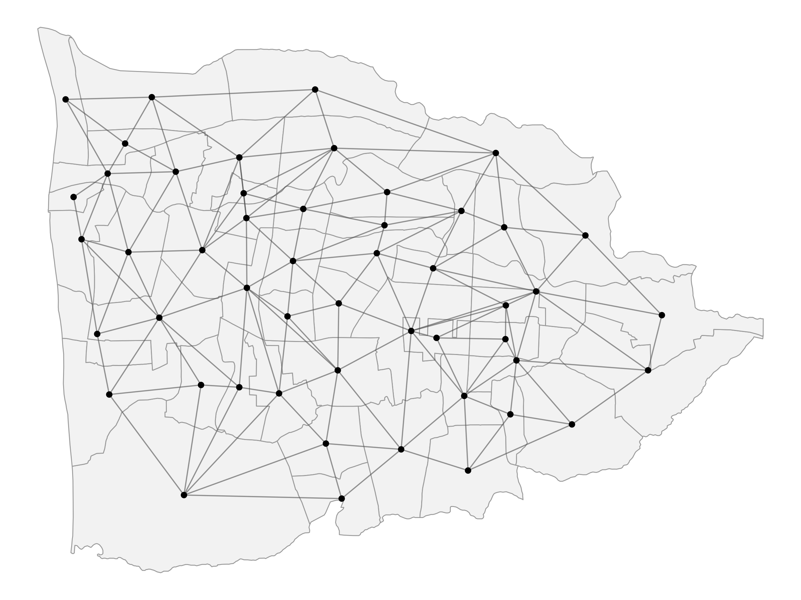

```{r, echo=FALSE}
library(tidyverse)
library(janitor)
library(readxl)
library(gt)
library(ggplot2)
library(dplyr)
```


## Latar Belakang

Data master UMKM Kota Mataram menjadi sumber informasi awal untuk memahami karakteristik, distribusi, dan kondisi usaha UMKM yang menjadi sasaran penelitian. Data tersebut digunakan untuk membangun konteks empiris mengenai populasi UMKM sebelum dilakukan analisis lebih lanjut mengenai kesiapan digital dan aspek sertifikasi halal.

Analisis dilakukan secara bertahap, dimulai dengan Analisis Data Eksploratori (Exploratory Data Analysis/EDA) untuk memahami struktur data, karakteristik UMKM, distribusi spasial, serta kualitas dan keterbatasan data. Tahap ini kemudian dilanjutkan dengan analisis dan pemodelan statistik serta spasial untuk mengidentifikasi pola, hubungan, dan variasi antarwilayah yang relevan dengan kesiapan digital dan sertifikasi halal.

Hasil analisis dan pemodelan selanjutnya digunakan untuk memperoleh insight mengenai faktor-faktor yang berkaitan dengan kesiapan digital, kondisi sertifikasi halal, serta variasinya antarwilayah. Temuan tersebut menjadi dasar dalam menyusun rekomendasi kebijakan yang lebih terarah, khususnya dalam menentukan kelompok dan wilayah yang memerlukan prioritas intervensi.

Dengan demikian, analisis tidak hanya diarahkan untuk menghasilkan deskripsi statistik, tetapi membangun alur analitis dari **pemahaman data, pemodelan, interpretasi hasil, hingga perumusan rekomendasi kebijakan**.

### Tujuan

Analisis ini bertujuan untuk:

1. mendeskripsikan karakteristik dan distribusi UMKM Kota Mataram berdasarkan informasi yang tersedia dalam data master;
2. mengevaluasi kualitas, kelengkapan, dan keterbatasan data sebagai dasar analisis;
3. mengidentifikasi pola dan karakteristik UMKM yang relevan dengan kesiapan digital dan sertifikasi halal;
4. menganalisis hubungan dan variasi kesiapan digital serta aspek sertifikasi halal melalui pendekatan statistik dan spasial;
5. menghasilkan *insight* empiris mengenai karakteristik dan wilayah UMKM yang berkaitan dengan kebutuhan intervensi; dan
6. menerjemahkan hasil analisis menjadi rekomendasi kebijakan yang dapat mendukung penentuan prioritas intervensi digitalisasi dan sertifikasi halal UMKM di Kota Mataram.


# Konteks Geografis: Kota Mataram

Kota Mataram merupakan wilayah perkotaan yang terdiri atas sejumlah kecamatan dan kelurahan dengan karakteristik geografis yang beragam.
Dalam analisis ini, unit spasial yang digunakan adalah kelurahan.
Sebanyak 50 kelurahan digunakan sebagai unit analisis untuk menggambarkan variasi kesiapan digital dan karakteristik UMKM secara spasial.

```{r, echo=FALSE, message=FALSE, warning=FALSE}
#| label: fig-mtrmap
#| fig-cap: "Peta 50 kelurahan di Kota Mataram sebagai unit analisis, dengan gradasi warna menunjukkan jumlah UMKM pada masing-masing kelurahan."

library(leaflet)
load("data/mtrvlg_umkm2.RData")

leaflet() %>%
  addTiles() %>%
  addPolygons(
  data = mtrvlg_umkm2,
  
  fillColor = ~colorNumeric(
    palette = viridisLite::viridis(256),
    domain = mtrvlg_umkm2$jumlah_umkm
  )(jumlah_umkm),
  
  fillOpacity = 0.85,
  color = "white",
  weight = 1,
  
  label = ~paste0(
    kelurahan,
    " | ",
    kecamatan,
    " | UMKM: ",
    jumlah_umkm
  ),
  
  popup = ~paste0(
    "<b>Kelurahan:</b> ", kelurahan, "<br>",
    "<b>Kecamatan:</b> ", kecamatan, "<br>",
    "<b>Jumlah UMKM:</b> ", jumlah_umkm
  )
)
```

```{r, echo=FALSE, message=FALSE, warning=FALSE}
#| label: fig-mtrnb
#| fig-cap: "Peta *neighbourhood* Kota Mataram berdasarkan queen contiguity."
#| fig-width: 8
#| fig-height: 6
#| out-width: "80%"


```


Struktur keterhubungan antarwilayah dibentuk menggunakan pendekatan *queen contiguity*, yaitu dua kelurahan dianggap bertetangga apabila memiliki batas atau titik sudut yang sama.
Struktur ini digunakan untuk merepresentasikan kedekatan spasial antarwilayah dalam analisis spasial selanjutnya.

# Dataset

Dataset yang digunakan pada penelitian ini terdiri dari data resmi (*official dataset*) dan data survei.
Data resmi diperoleh dari data administrasi Dinas Koperasi Kota Mataram, sedangkan data survei diperoleh dari hasil survei UMKM yang dilakukan oleh tim riset.
Berikut merupakan uraian singkat dari setiap dataset.

## Data resmi: profil UMKM kota Mataram

Selain data primer yang diperoleh melalui survei, penelitian ini menggunakan data administratif UMKM yang diperoleh dari Dinas terkait di Kota Mataram.
Dataset tersebut digunakan untuk memberikan gambaran mengenai populasi dan karakteristik UMKM yang menjadi konteks penelitian.
Dataset terdiri atas 4.185 unit usaha dengan 17 variabel yang mencakup informasi identitas usaha, karakteristik usaha, lokasi, klasifikasi kegiatan usaha, serta beberapa karakteristik ekonomi dan ketenagakerjaan.

Informasi yang tersedia meliputi nomor identifikasi usaha (NIB), nama perusahaan, jenis perusahaan, tingkat risiko proyek, skala usaha, alamat usaha, kecamatan dan kelurahan, kode dan uraian KBLI, identitas pemilik usaha, serta informasi kontak.
Dataset juga memuat beberapa variabel kuantitatif, yaitu luas tanah, jumlah investasi, dan jumlah tenaga kerja.
Dengan demikian, data administratif ini menyediakan informasi mengenai karakteristik struktural dan spasial UMKM yang tidak seluruhnya diperoleh dari instrumen survei.

### Ringkasan Karakteristik UMKM

Data administratif yang diperoleh dari dinas terkait mencakup 4185 unit usaha yang tersebar di wilayah Kota Mataram.
Berdasarkan @tbl-summaryumkm, karakteristik UMKM menunjukkan adanya variasi jumlah unit usaha antar kecamatan di Kota Mataram.
Jumlah UMKM terbanyak tercatat di Kecamatan Mataram, yaitu 802 unit, diikuti Cakranegara sebanyak 799 unit dan Sandubaya sebanyak 785 unit.
Sementara itu, jumlah UMKM lebih rendah terdapat di Selaparang sebanyak 627 unit, Ampenan sebanyak 601 unit, dan Sekarbela sebanyak 571 unit.

```{r, echo=FALSE, warning=FALSE, message=FALSE}
#| label: tbl-summaryumkm
#| tbl-cap: "Ringkasan variabel numerik pada data UMKM"

umkm <- read_excel(
  "data/umkm.xlsx",
  sheet = "DATA UMKM TAHUN 2024",
  skip = 2
) |>
  clean_names()

umkm <- umkm %>% 
  select(-no, -nib, -nama_perusahaan, 
         -alamat_usaha, -email, -nomor_telp,
         -nama_pemilik_usaha) %>% 
  rename(investasi = jumlah_investasi_rp,
         luas = luas_tanah_mm
         ) %>% 
  mutate(
    kecamatan = recode(
      kecamatan,
      "Selaprang" = "Selaparang"
    )
  )


sum_kec <- umkm %>%
  group_by(kecamatan) %>%
  summarise(
    n = n(),
    investasi_median = median(investasi, na.rm = TRUE) / 1e6,
    investasi_q1 = quantile(investasi, 0.25, na.rm = TRUE) / 1e6,
    investasi_q3 = quantile(investasi, 0.75, na.rm = TRUE) / 1e6,
    tenaga_kerja_mean = mean(tki_org, na.rm = TRUE),
    tenaga_kerja_q1 = quantile(tki_org, 0.25, na.rm = TRUE),
    tenaga_kerja_q3 = quantile(tki_org, 0.75, na.rm = TRUE),
    .groups = "drop"
  ) %>%
  mutate(
    Investasi = sprintf(
      "%.1f (%.1f–%.1f)",
      investasi_median,
      investasi_q1,
      investasi_q3
    ),
    `Tenaga Kerja` = sprintf(
      "%.0f (%.0f–%.0f)",
      tenaga_kerja_mean,
      tenaga_kerja_q1,
      tenaga_kerja_q3
    )
  ) %>%
  select(
    kecamatan = kecamatan,
    `Jumlah UMKM` = n,
    `Investasi (Rp juta)` = Investasi,
    `Tenaga Kerja` = `Tenaga Kerja`
  )

# Komposisi skala usaha per kecamatan
skala_kec <- umkm %>%
  count(kecamatan, skala_usaha) %>%
  group_by(kecamatan) %>%
  mutate(
    persentase = 100 * n / sum(n)
  ) %>%
  ungroup() %>%
  mutate(
    skala = paste0(
      n, " (", round(persentase, 1), "%)"
    )
  ) %>%
  select(kecamatan, skala_usaha, skala) %>%
  pivot_wider(
    names_from = skala_usaha,
    values_from = skala,
    values_fill = "0 (0.0%)"
  )

# Gabungkan
sum_kec <- sum_kec %>%
  left_join(skala_kec, by = "kecamatan") 


sum_kec %>%
  gt() %>%
  fmt_number(
    columns = `Jumlah UMKM`,
    decimals = 0
  ) %>%
  cols_align(
    align = "center",
    columns = everything()
  ) %>%
  tab_header(
    title = "Karakteristik UMKM Menurut Kecamatan",
    subtitle = "Jumlah UMKM dan komposisi skala usaha; investasi dan tenaga kerja disajikan sebagai median (Q1–Q3)"
  )
```

Dari sisi investasi, median investasi per UMKM berkisar antara Rp10 juta hingga Rp20 juta. Kecamatan Mataram dan Sandubaya memiliki median investasi sebesar Rp20 juta, sedangkan Ampenan memiliki median terendah sebesar Rp10 juta. Rentang antarkuartil menunjukkan bahwa distribusi investasi cukup lebar pada seluruh kecamatan, dengan nilai kuartil atas mencapai Rp50 juta di beberapa kecamatan.

Median tenaga kerja relatif seragam, yaitu dua orang per UMKM pada seluruh kecamatan. Rentang antarkuartil juga relatif sempit, yaitu sekitar 1–2 orang, sehingga berdasarkan data administratif ini sebagian besar unit usaha memiliki jumlah tenaga kerja yang relatif kecil.

Komposisi skala usaha menunjukkan pola yang sangat konsisten antar kecamatan. UMKM didominasi oleh usaha mikro, dengan proporsi antara 91,1% di Kecamatan Mataram hingga 94,5% di Kecamatan Sandubaya. Usaha kecil memiliki proporsi sekitar 3,6–7,0%, sedangkan usaha besar dan usaha menengah hanya mencakup sebagian kecil unit usaha. Proporsi usaha menengah bahkan tidak melebihi 0,5% pada kecamatan yang ditampilkan.

```{r, echo=FALSE, warning=FALSE, message=FALSE}
#| label: tbl-bentuk-usaha-umkm
#| tbl-cap: "Distribusi UMKM menurut bentuk usaha"


bentuk_usaha <- umkm %>%
  mutate(
    bentuk_usaha_ringkas = case_when(
      jenis_perusahaan %in% c(
        "Koperasi",
        "Persekutuan dan Perkumpulan",
        "Badan Hukum Lainnya",
        "Persekutuan Perdata",
        "Perusahaan Umum (Perum)"
      ) ~ "Lainnya",
      TRUE ~ jenis_perusahaan
    )
  ) %>%
  count(bentuk_usaha_ringkas, name = "n") %>%
  mutate(
    persentase = 100 * n / sum(n),
    `Bentuk Usaha` = bentuk_usaha_ringkas,
    `Jumlah (n)` = n,
    `Persentase (%)` = sprintf("%.1f", persentase)
  ) %>%
  select(
    `Bentuk Usaha`,
    `Jumlah (n)`,
    `Persentase (%)`
  ) %>%
  arrange(desc(`Jumlah (n)`))

bentuk_usaha %>%
  gt() %>%
  fmt_number(
    columns = `Jumlah (n)`,
    decimals = 0
  ) %>%
  cols_align(
    align = "center",
    columns = everything()
  ) %>%
  tab_header(
    title = "Bentuk Usaha UMKM",
    subtitle = "Distribusi 4.185 unit usaha berdasarkan bentuk kelembagaan"
  )
```

Pada tingkat kecamatan, jumlah UMKM dan komposisi skala usaha menunjukkan variasi antarwilayah.
@tbl-summaryumkm juga menunjukkan perbedaan karakteristik investasi dan tenaga kerja antar kecamatan.
Informasi ini memberikan konteks terhadap variasi spasial UMKM yang selanjutnya direpresentasikan pada tingkat kelurahan dalam analisis spasial.

Selain itu, berdasarkan karakteristik kelembagaannya (@tbl-bentuk-usaha-umkm), UMKM dalam dataset ini didominasi oleh usaha berbentuk perorangan, yaitu sebanyak 3560 unit atau 85.1%.
Bentuk usaha lainnya terdiri atas CV sebanyak 370 unit (8.8%), dan PT sebanyak 237 unit (5.7%).
Lima unit usaha lainnya (0.4%) tercatat dalam beberapa bentuk kelembagaan dengan jumlah yang sangat kecil.

<!-- Selain karakteristik kategorikal, dataset juga memuat informasi mengenai jumlah investasi dan tenaga kerja. -->
<!-- Variabel `jumlah_investasi_rp` menunjukkan nilai investasi usaha dalam rupiah, sedangkan `tki_org` menunjukkan jumlah tenaga kerja pada masing-masing unit usaha. -->
<!-- Karena kedua variabel tersebut memiliki skala yang berbeda dan berpotensi memiliki distribusi yang menceng, statistik deskriptif seperti median dan rentang interkuartil digunakan sebagai pelengkap nilai rata-rata. -->

<!-- Data administratif ini selanjutnya digunakan sebagai sumber informasi mengenai karakteristik dan distribusi UMKM, sedangkan data survei digunakan untuk membangun dan mengukur *Digital Readiness Index* (DRI). -->
<!-- Pemisahan fungsi kedua sumber data tersebut penting karena DRI dibentuk berdasarkan respons terhadap item-item instrumen survei, bukan berdasarkan variabel administratif dari Dinas. -->


```{r, echo=FALSE, warning=FALSE, message=FALSE}
#| label: tbl-kbli
#| tbl-cap: "Distribusi 4185 unit usaha berdasarkan kelompok KBLI tiga digit"

load("data/kelompok_kbli.RData")

# # Mapping kelompok KBLI 3 digit
# kbli_label <- c(
#   "141" = "Pembuatan pakaian",
#   "451" = "Perdagangan mobil",
#   "453" = "Perdagangan suku cadang dan aksesori mobil",
#   "454" = "Perdagangan suku cadang dan aksesori sepeda motor",
#   "461" = "Perdagangan besar atas dasar balas jasa/kontrak",
#   "462" = "Perdagangan besar hasil pertanian",
#   "463" = "Perdagangan besar makanan dan minuman",
#   "464" = "Perdagangan besar barang keperluan rumah tangga",
#   "465" = "Perdagangan besar mesin dan peralatan",
#   "466" = "Perdagangan besar peralatan khusus",
#   "469" = "Perdagangan besar berbagai macam barang",
#   "471" = "Perdagangan eceran berbagai macam barang",
#   "472" = "Perdagangan eceran makanan dan hasil pertanian",
#   "473" = "Perdagangan eceran BBM dan LPG",
#   "474" = "Perdagangan eceran komputer dan perlengkapannya",
#   "475" = "Perdagangan eceran peralatan rumah tangga",
#   "476" = "Perdagangan eceran hasil pencetakan dan penerbitan",
#   "477" = "Perdagangan eceran khusus",
#   "478" = "Perdagangan eceran kaki lima dan los pasar",
#   "479" = "Perdagangan eceran bukan di toko",
#   "561" = "Penyediaan makanan",
#   "562" = "Jasa boga/katering",
#   "563" = "Penyediaan minuman",
#   "962" = "Aktivitas penatu"
# )
# 
# kelompok_kbli <- umkm %>%
#   mutate(
#     kbli_3digit = substr(kbli, 1, 3),
#     kelompok_usaha = recode(
#       kbli_3digit,
#       !!!kbli_label
#     )
#   ) %>%
#   count(kbli_3digit, kelompok_usaha, name = "n") %>%
#   mutate(
#     persentase = 100 * n / sum(n)
#   ) %>%
#   arrange(desc(n)) %>%
#   transmute(
#     `Kelompok Kegiatan Usaha` = kelompok_usaha,
#     `Jumlah (n)` = n,
#     `Persentase (%)` = sprintf("%.1f", persentase)
#   )

kelompok_kbli %>%
  gt() %>%
  fmt_number(
    columns = `Jumlah (n)`,
    decimals = 0
  ) %>%
  cols_align(
    align = "center",
    columns = c(`Jumlah (n)`, `Persentase (%)`)
  ) %>%
  tab_header(
    title = "Kelompok Kegiatan Usaha UMKM"
  )

```

Berdasarkan klasifikasi KBLI tiga digit (@tbl-kbli), kegiatan usaha dalam dataset menunjukkan keragaman yang cukup luas, dengan 24 kelompok kegiatan yang teridentifikasi.
Distribusi tersebut terutama terkonsentrasi pada beberapa kelompok kegiatan utama.
Kelompok 561, yang berkaitan dengan penyediaan makanan, merupakan kelompok dengan jumlah UMKM terbesar, yaitu 935 unit (22.3%).
Selanjutnya, kelompok 477 dan 471 masing-masing mencakup 684 unit (16.3%) dan 674 unit (16.1%). 
Kelompok 472 mencakup 381 unit (9.1%), sedangkan kelompok 463 mencakup 243 unit (5.8%). 
Kelompok-kelompok kegiatan lainnya memiliki proporsi yang lebih kecil.

## Data survei

Survei yang digunakan dalam penelitian ini dirancang untuk memperoleh gambaran mengenai karakteristik usaha sekaligus tingkat kesiapan digital pelaku Usaha Mikro, Kecil, dan Menengah (UMKM). Instrumen terdiri atas bagian informasi umum mengenai usaha dan pemilik, serta sejumlah pernyataan yang mengukur aspek-aspek terkait penggunaan dan kesiapan teknologi digital. Pada bagian karakteristik usaha, responden diminta memberikan informasi mengenai jenis usaha, penggunaan kanal penjualan atau pembelian secara daring, usia usaha, jumlah tenaga kerja, omzet bulanan, serta karakteristik pemilik seperti usia dan pendidikan terakhir. Informasi lokasi usaha juga dikumpulkan hingga tingkat kelurahan.

Bagian utama instrumen menggunakan skala Likert lima tingkat, yaitu *Sangat Tidak Setuju* (STS), *Tidak Setuju* (TS), *Netral* (N), *Setuju* (S), dan *Sangat Setuju* (SS). Pernyataan dalam instrumen mencakup beberapa aspek kesiapan dan pemanfaatan teknologi digital. Aspek-aspek tersebut meliputi **infrastruktur digital**, **keterampilan digital**, **proses bisnis**, **strategi digital**, **keamanan digital**, serta **data dan inovasi**. Misalnya, infrastruktur digital mencakup kestabilan koneksi internet, ketersediaan perangkat yang memadai, dan penggunaan aplikasi daring atau *cloud*. Sementara itu, keterampilan digital mencakup kemampuan dasar menggunakan teknologi, pengalaman mengikuti pelatihan digital, dan pemahaman mengenai pemasaran digital.

Selain aspek-aspek tersebut, instrumen juga memuat pertanyaan mengenai **e-commerce dan media sosial** serta **sertifikasi halal**. Bagian e-commerce dan media sosial mengukur penggunaan media sosial untuk promosi, pemanfaatan *marketplace*, dan proporsi penjualan yang berasal dari kanal daring. Bagian sertifikasi halal mengukur pengetahuan, persepsi manfaat, hambatan, dukungan pemerintah, kesiapan administrasi, serta kebutuhan pendampingan dalam proses sertifikasi.

Dalam penelitian ini, tidak seluruh bagian survei digunakan sebagai indikator pembentuk DRI. Item yang secara substantif merepresentasikan kesiapan dan kapabilitas digital dipilih dan selanjutnya dikelompokkan ke dalam lima dimensi DRI, yaitu **Skill**, **Business**, **Strategy**, **Security**, dan **Data**. Dengan demikian, informasi karakteristik usaha dan bagian survei lainnya digunakan sebagai informasi pendukung atau variabel penelitian, sedangkan item yang relevan dengan lima dimensi tersebut menjadi dasar dalam proses evaluasi struktur instrumen dan konstruksi skor DRI.


## Konstruksi Digital Readiness Index (DRI)

*Digital Readiness Index* (DRI) dikonstruksi untuk memperoleh satu ukuran komposit yang merepresentasikan tingkat kesiapan digital pada setiap responden. Konstruksi DRI diawali dengan identifikasi struktur dimensi yang mendasari instrumen pengukuran. Instrumen awal terdiri atas enam kelompok indikator, yaitu Infrastruktur (INF), Skill (SKL), Business (BUS), Strategy (STR), Security (SEC), dan Data (DAT). Sebelum skor indeks dihitung, dilakukan pemeriksaan terhadap kelayakan data untuk analisis faktor. Nilai Kaiser–Meyer–Olkin (KMO) secara keseluruhan sebesar 0,94 menunjukkan bahwa korelasi antaritem sangat memadai untuk analisis faktor. Selain itu, uji Bartlett terhadap matriks korelasi menghasilkan $\chi^2=8001.616$ dengan $df=153$ dan $p<0.001$, sehingga hipotesis bahwa matriks korelasi merupakan matriks identitas ditolak. Dengan demikian, data memenuhi persyaratan awal untuk mengevaluasi struktur konstruk.

Selanjutnya dilakukan *exploratory factor analysis* (EFA) menggunakan metode minimum residual (minres), rotasi oblimin, dan matriks korelasi polikhorik karena indikator diukur pada skala ordinal. *Parallel analysis* memberikan indikasi awal adanya tiga faktor statistik. Namun, hasil tersebut tidak langsung digunakan sebagai dasar untuk menetapkan struktur substantif DRI. Evaluasi struktur juga mempertimbangkan kerangka konseptual instrumen dan interpretabilitas indikator. Hasil EFA tiga faktor menunjukkan bahwa sebagian besar indikator memiliki *communality* yang tinggi, tetapi beberapa indikator menunjukkan *cross-loading*. Secara khusus, indikator INF1 dan INF2 membentuk kelompok yang berbeda dari INF3, sedangkan INF3 menunjukkan pola pemuatan yang lebih dekat dengan kelompok kemampuan (*capability*). Hal ini menunjukkan bahwa struktur empiris tidak sepenuhnya mereproduksi pengelompokan awal indikator berdasarkan label konseptual.

Temuan tersebut penting karena tujuan penelitian bukan semata-mata memperoleh jumlah faktor statistik yang paling kecil, tetapi membangun indeks yang memiliki interpretasi substantif dan dapat digunakan secara konsisten pada tahap analisis berikutnya. Oleh karena itu, evaluasi struktur dilakukan dengan mempertimbangkan kombinasi antara hasil analisis faktor eksploratori, makna substantif setiap indikator, serta struktur konseptual DRI yang digunakan dalam penelitian.

```{r, echo=FALSE, warning=FALSE, message=FALSE}
#| label: tbl-dimdri
#| tbl-cap: "Dimensi Penyusun Digital Readiness Index"

library(dplyr)
library(gt)

dimensi_dri <- tibble(
  Dimensi = c(
    "Skill",
    "Business",
    "Strategy",
    "Security",
    "Data"
  ),
  Kode = c(
    "SKL",
    "BUS",
    "STR",
    "SEC",
    "DAT"
  ),
  Indikator = c(
    "SKL1–SKL3",
    "BUS1–BUS3",
    "STR1–STR2",
    "SEC1–SEC2",
    "DAT1–DAT2"
  ),
  Deskripsi = c(
    "Keterampilan dan kemampuan dasar dalam menggunakan teknologi digital.",
    "Pemanfaatan teknologi digital dalam proses dan aktivitas bisnis.",
    "Perencanaan dan penerapan strategi yang berkaitan dengan pemanfaatan teknologi digital.",
    "Kesadaran dan praktik terkait keamanan dalam penggunaan teknologi dan informasi digital.",
    "Pemanfaatan data dan teknologi untuk mendukung informasi, pengambilan keputusan, dan inovasi."
  )
)

dimensi_dri %>%
  gt() %>%
  tab_header(
    title = "Struktur akhir konstruk DRI yang digunakan dalam penelitian"
  ) %>%
  cols_label(
    Dimensi = "Dimensi",
    Kode = "Kode",
    Indikator = "Indikator",
    Deskripsi = "Aspek yang diukur"
  ) %>%
  cols_align(
    align = "center",
    columns = c(Dimensi, Kode, Indikator)
  ) %>%
  cols_align(
    align = "left",
    columns = Deskripsi
  ) %>%
  tab_options(
    table.font.size = px(12),
    data_row.padding = px(6)
  )
```


Berdasarkan evaluasi tersebut, indikator Infrastructure tidak dipertahankan sebagai dimensi tersendiri dalam konstruksi skor akhir. Dengan demikian, struktur operasional DRI yang digunakan terdiri atas lima dimensi, yaitu Skill, Business, Strategy, Security, dan Data. Kelima dimensi tersebut selanjutnya diperlakukan sebagai komponen utama dari konstruk Digital Readiness.

Untuk memastikan bahwa kelima dimensi tersebut memiliki dasar pengukuran yang memadai, dilakukan pengujian *confirmatory factor analysis* (CFA) pada struktur first-order. Hasil CFA menunjukkan bahwa indikator-indikator pada masing-masing dimensi memiliki standardized factor loading yang tinggi dan signifikan. Pada dimensi Skill, misalnya, loading SKL1, SKL2, dan SKL3 masing-masing sebesar 0,811, 1,020, dan 0,867. Pada dimensi Business, loading BUS1–BUS3 berada pada kisaran 0,895–0,965. Dimensi Strategy memiliki loading 0,889 dan 0,942, Security sebesar 0,964 dan 0,951, sedangkan Data sebesar 0,923 dan 0,873. Secara umum, hasil tersebut menunjukkan bahwa indikator-indikator yang dipertahankan memberikan kontribusi kuat terhadap dimensi masing-masing.

Selanjutnya, struktur lima dimensi juga dievaluasi melalui model second-order, dengan DigitalCapability sebagai konstruk tingkat kedua yang direfleksikan oleh Skill, Business, Strategy, Security, dan Data. Model menghasilkan CFI = 0,998, TLI = 0,997, dan SRMR = 0,059, yang menunjukkan kesesuaian model yang baik pada beberapa indeks fit. Namun demikian, model juga menghasilkan indikasi Heywood case, khususnya varians residual negatif pada dimensi Data dan beberapa permasalahan varians pada konstruk laten. Oleh karena itu, hasil second-order CFA tidak digunakan sebagai dasar utama untuk mengestimasi skor indeks. Model tersebut digunakan terutama sebagai evaluasi terhadap struktur konstruk, sedangkan konstruksi skor DRI dilakukan dengan pendekatan komposit yang lebih sederhana dan transparan.

### Standardisasi Skor Dimensi

Sebelum digabungkan menjadi indeks komposit, skor untuk masing-masing dimensi distandardisasi menggunakan *z-score*. Standardisasi dilakukan untuk menempatkan kelima dimensi pada skala yang sama sehingga dimensi dengan variabilitas awal yang berbeda tidak memberikan pengaruh yang tidak proporsional terhadap nilai indeks.

Untuk setiap dimensi $d$, skor terstandardisasi dihitung sebagai

$$
Z_{id} = \frac{X_{id} - \bar{X}_{d}}{s_d},
$$

dengan $X_{id}$ menyatakan skor dimensi $d$ untuk responden $i$, $\bar{X}_{d}$ adalah rata-rata skor dimensi tersebut, dan $s_d$ adalah standar deviasi skor dimensi tersebut.

Dengan demikian, diperoleh lima skor terstandardisasi:

-   $Skill_z$ untuk dimensi Skill;
-   $Business_z$ untuk dimensi Business;
-   $Strategy_z$ untuk dimensi Strategy;
-   $Security_z$ untuk dimensi Security; dan
-   $Data_z$ untuk dimensi Data.

Kelima dimensi menunjukkan hubungan yang kuat satu sama lain. Korelasi antardimensi berada pada kisaran 0.733--0.883. Selain itu, konsistensi internal kelima skor dimensi sebagai satu set ukuran komposit menunjukkan nilai Cronbach's alpha sebesar 0.95 (95% CI: 0.94--0.96). Hasil tersebut mendukung penggunaan kelima dimensi secara bersama-sama dalam pembentukan ukuran komposit Digital Readiness.

### Pembentukan DRI

Setelah standardisasi, DRI dihitung sebagai rata-rata dari kelima skor dimensi:

$$
DRI_i =
\frac{
Skill_{z,i} +
Business_{z,i} +
Strategy_{z,i} +
Security_{z,i} +
Data_{z,i}
}{5}.
$$


Pada dataset akhir, seluruh 388 responden memiliki skor lengkap untuk kelima dimensi sehingga tidak terdapat responden yang kehilangan dimensi pada proses pembentukan DRI.

Nilai DRI merupakan composite standardized index, karena indeks dibentuk dari skor-skor dimensi yang telah distandardisasi menggunakan z-score. DRI tidak menggunakan transformasi min--max normalization. Oleh karena itu, nilai DRI dapat bernilai negatif maupun positif.

Secara substantif, nilai DRI diinterpretasikan relatif terhadap rata-rata sampel.
Nilai DRI yang lebih tinggi menunjukkan tingkat kesiapan digital yang relatif lebih tinggi, sedangkan nilai yang lebih rendah menunjukkan tingkat kesiapan digital yang relatif lebih rendah.
Nilai yang mendekati nol menunjukkan tingkat kesiapan digital yang berada di sekitar rata-rata sampel.

### Pemeriksaan Distribusi DRI

Histogram `DRI` menunjukkan bahwa nilai indeks terkonsentrasi di sekitar nilai tengah, dengan sebagian besar observasi berada pada kisaran nilai negatif hingga positif moderat.
Setelah standardisasi, nilai DRI memiliki rata-rata 0 dan berada pada rentang −1,37 hingga 2,27.
Median sebesar −0,17 yang sedikit lebih rendah daripada rata-rata menunjukkan bahwa distribusi cenderung sedikit menceng ke kanan.


```{r, echo=FALSE, message=FALSE, warning=FALSE}
#| label: fig-histdri
#| fig-cap: "Distribusi indeks kesiapan digital (DRI) UMKM Kota Mataram setelah standardisasi"

load("data/dri_score.RData")
median_dri <- median(scale(dri_score$DRI), na.rm = TRUE)

ggplot(dri_score, aes(x = scale(DRI))) +
  geom_histogram(
    aes(y = after_stat(density)),
    bins = 30
  ) +
  geom_density(linewidth = 1) +
  geom_vline(
    xintercept = median_dri,
    linetype = "dashed"
  ) +
  annotate(
    "text",
    x = median_dri,
    y = Inf,
    label = paste0("Median = ", round(median_dri, 2)),
    vjust = 1.5,
    hjust = -0.1
  ) +
  labs(
    x = "DRI terstandardisasi",
    y = "Kerapatan"
  ) +
  theme_minimal()
```


Hal ini juga tercermin dari adanya sejumlah observasi dengan nilai DRI yang relatif tinggi, hingga mencapai 2,27, sementara nilai terendah berada pada −1,37.
Kuartil pertama sebesar −0,86 dan kuartil ketiga sebesar 0,74 menunjukkan bahwa 50% observasi berada dalam rentang tersebut.
Dengan demikian, histogram memperlihatkan distribusi DRI yang relatif terkonsentrasi di sekitar pusat, tetapi dengan ekor kanan yang lebih panjang akibat keberadaan beberapa UMKM dengan tingkat kesiapan digital yang relatif tinggi.

### Agregasi DRI pada Unit Spasial

Karena analisis selanjutnya dilakukan pada tingkat kelurahan, skor DRI individual diagregasikan ke tingkat kelurahan. Nilai DRI kelurahan dihitung sebagai rata-rata DRI seluruh responden yang berada pada kelurahan tersebut:

$$
DRI_j^{(\mathrm{area})}
=
\frac{1}{n_j}
\sum_{i=1}^{n_j} DRI_{ij},
$$

dengan $DRI_j^{(area)}$ merupakan nilai DRI pada kelurahan $j$, $n_j$ adalah jumlah responden pada kelurahan $j$, dan $DRI_{ij}$ adalah skor DRI responden $i$ pada kelurahan $j$.

```{r, echo=FALSE, warning=FALSE, message=FALSE}
#| label: fig-drimtrvlg
#| fig-cap: "DRI(standardized) per Kelurahan"


load("data/mtrvlg_dri.RData")

ggplot(mtrvlg_dri) +
  geom_sf(aes(fill = scale(DRI)), color = "white", linewidth = 0.2) +
  scale_fill_viridis_c(
    option = "viridis",
    na.value = "grey90"
  ) +
  labs(
    fill = "DRI"
  ) +
  theme_void() +
  theme(
    legend.position = "right",
    legend.title = element_text(size = 10),
    legend.text = element_text(size = 9)
  )

# dri_kel <- dri_score %>%
#   group_by(kecamatan, kelurahan) %>%
#   summarise(
#     n = n(),
#     DRI = mean(DRI, na.rm = TRUE),
#     DRI_sd = ifelse(
#       n() > 1,
#       sd(DRI, na.rm = TRUE),
#       NA_real_
#     ),
#     DRI_se = ifelse(
#       n() > 1,
#       sd(DRI, na.rm = TRUE) / sqrt(n()),
#       NA_real_
#     ),
#     .groups = "drop"
#   )
# 
# dri_kel
```

Hasil agregasi menghasilkan 35 kelurahan dengan jumlah responden yang tidak sama antarwilayah.
Oleh karena itu, selain nilai rata-rata DRI, jumlah responden ($n$) dan ukuran variasi DRI pada masing-masing kelurahan juga disimpan untuk keperluan pemeriksaan dan analisis selanjutnya.
Dengan konstruksi tersebut, DRI yang digunakan sebagai *response variable* dalam analisis spasial merepresentasikan rata-rata tingkat kesiapan digital pada tingkat kelurahan, bukan skor individual responden.
@fig-drimtrvlg memberikan gambaran awal mengenai pola spasial kesiapan digital sebelum dilakukan pemodelan lebih lanjut.

## Aspek halal

Aspek halal dalam penelitian ini diukur melalui sepuluh pernyataan dengan skala Likert lima tingkat. Kesepuluh pernyataan mencakup pemahaman dan persepsi manfaat sertifikasi halal, pengetahuan serta kesiapan dalam proses sertifikasi, hambatan yang dihadapi, dukungan pemerintah, dan akses terhadap layanan sertifikasi halal.

### Analisis Deskriptif

Secara deskriptif, respons UMKM cenderung menunjukkan penilaian yang positif terhadap manfaat sertifikasi halal. Hal ini terutama terlihat pada HAL2, HAL6, dan HAL9. Pada HAL2, yaitu pernyataan bahwa sertifikasi halal meningkatkan kepercayaan konsumen, sebanyak 52% responden memberikan skor 4 dan 35% memberikan skor 5. Pada HAL6 mengenai peningkatan daya saing produk, 55% responden memberikan skor 4 dan 30% skor 5. Sementara itu, pada HAL9 mengenai kemampuan sertifikasi halal dalam memperluas pasar, 56% responden memberikan skor 4 dan 34% skor 5. HAL1 mengenai pentingnya sertifikasi halal juga menunjukkan kecenderungan respons positif, dengan 43% responden memberikan skor 4 dan 28% skor 5.

```{r, echo=FALSE, message=FALSE, warning=FALSE}
library(dplyr)
library(tidyr)
library(ggplot2)
library(scales)

load("data/halal_score.RData")

halal_likert <- halal_score %>%
  select(starts_with("HAL")) %>%
  pivot_longer(
    cols = everything(),
    names_to = "item",
    values_to = "score"
  ) %>%
  filter(!is.na(score)) %>%
  count(item, score) %>%
  group_by(item) %>%
  mutate(
    prop = n / sum(n)
  ) %>%
  ungroup() %>%
  mutate(
    item = factor(item, levels = paste0("HAL", 1:10)),
    score = factor(score, levels = 1:5)
  )

ggplot(
  halal_likert[1:50,],
  aes(
    x = item,
    y = prop,
    fill = factor(score)
  )
) +
  geom_col(width = 0.8) +
  coord_flip() +
  scale_y_continuous(
    labels = percent_format(),
    expand = c(0, 0)
  ) +
  scale_fill_viridis_d(
    option = "cividis",
    direction = -1,
    name = "Skor"
  ) +
  labs(
    x = NULL,
    y = "Proporsi responden",
    title = "Distribusi Respons UMKM terhadap Pernyataan Halal"
  ) +
  theme_minimal()

```

Pola tersebut menunjukkan bahwa sertifikasi halal secara umum dipandang positif oleh responden, khususnya dalam kaitannya dengan kepercayaan konsumen, daya saing, dan perluasan pasar. Namun, persepsi positif mengenai manfaat sertifikasi tidak dengan sendirinya menunjukkan bahwa UMKM telah memiliki kesiapan yang sama untuk menjalankan proses sertifikasi. Oleh karena itu, item-item halal selanjutnya dianalisis untuk melihat apakah terdapat beberapa aspek yang berbeda dalam pengalaman dan persepsi UMKM terhadap sertifikasi halal.

### Struktur dan pengelompokan aspek halal

Analisis korelasi polikorik terhadap sepuluh item menunjukkan bahwa hubungan antaritem cukup beragam. Beberapa item menunjukkan korelasi yang tinggi, terutama HAL1, HAL2, HAL6, dan HAL9. Korelasi antara HAL1 dan HAL2 sebesar 0,818, HAL2 dan HAL6 sebesar 0,835, HAL6 dan HAL9 sebesar 0,804, serta HAL2 dan HAL9 sebesar 0,733. Sebaliknya, beberapa pasangan item menunjukkan hubungan yang relatif rendah, misalnya korelasi HAL3 dengan HAL8 sebesar -0,042 dan HAL7 dengan HAL8 sebesar 0,025.

Pola tersebut menunjukkan bahwa sepuluh item tidak sepenuhnya menggambarkan satu dimensi yang homogen. Secara substantif, item-item tersebut memang mencakup beberapa aspek yang berbeda. Berdasarkan pola hubungan antaritem dan kerangka pertanyaan, empat item, yaitu HAL1, HAL2, HAL6, dan HAL9, dikelompokkan sebagai aspek kesadaran dan persepsi manfaat sertifikasi halal. HAL3 dan HAL7 membentuk aspek kesiapan sertifikasi halal, sedangkan HAL4 dan HAL8 merepresentasikan hambatan dalam proses sertifikasi halal. HAL5 dan HAL10 dipertahankan sebagai indikator tunggal yang masing-masing menggambarkan persepsi terhadap dukungan pemerintah dan akses terhadap layanan sertifikasi halal.

| Aspek                            | Item                   | Makna                                              |
|-------------------|-------------------|-----------------------------------|
| Awareness and Perceived Benefits | HAL1, HAL2, HAL6, HAL9 | Pemahaman dan persepsi manfaat sertifikasi         |
| Readiness                        | HAL3, HAL7             | Pengetahuan prosedur dan kesiapan administratif    |
| Barrier                          | HAL4, HAL8             | Kendala dan kebutuhan pendampingan                 |
| Support                          | HAL5                   | Persepsi terhadap sosialisasi pemerintah           |
| Access                           | HAL10                  | Persepsi mengenai akses layanan berdasarkan lokasi |

Pengelompokan tersebut juga memperoleh dukungan dari analisis CFA ordinal menggunakan estimator WLSMV. Loading terstandar untuk dimensi kesadaran dan persepsi manfaat berada pada rentang 0,834–0,919. Pada dimensi kesiapan, loading HAL3 dan HAL7 masing-masing sebesar 0,893 dan 0,884. Untuk dimensi hambatan, loading HAL4 sebesar 0,546 dan HAL8 sebesar 0,909.

```{r, echo=FALSE, message=FALSE, warning=FALSE}
library(ggplot2)
library(dplyr)
library(tidyr)

load("data/cor_df.RData")
item_order <- c(
  "HAL1", "HAL2", "HAL6", "HAL9",
  "HAL3", "HAL7",
  "HAL4", "HAL8",
  "HAL5", "HAL10"
)

cor_df <- cor_df %>%
  mutate(
    item1 = factor(item1, levels = item_order),
    item2 = factor(item2, levels = rev(item_order))
  )

ggplot(
  cor_df,
  aes(x = item1, y = item2, fill = rho)
) +
  geom_tile(color = "white", linewidth = 0.5) +
  geom_text(
    aes(label = sprintf("%.2f", rho)),
    size = 3
  ) +
  scale_fill_viridis_c(
    option = "viridis",
    limits = c(-1, 1),
    name = "Korelasi"
  ) +
  coord_equal() +
  labs(
    x = NULL,
    y = NULL
  ) +
  theme_minimal() +
  theme(
    panel.grid = element_blank(),
    axis.text.x = element_text(
      angle = 45,
      hjust = 1
    )
  )
```

Meskipun demikian, ukuran kesesuaian model secara keseluruhan belum menunjukkan kecocokan yang sepenuhnya baik. CFI dan TLI standar masing-masing sebesar 0,990 dan 0,983, sedangkan RMSEA sebesar 0,146 dan SRMR sebesar 0,072. Nilai robust CFI sebesar 0,872 dan robust RMSEA sebesar 0,211 juga menunjukkan bahwa model tidak sebaik jika hanya dinilai berdasarkan indeks fit standar. Oleh karena itu, hasil CFA dalam penelitian ini lebih tepat digunakan sebagai informasi pendukung mengenai pola pengelompokan indikator, bukan sebagai dasar untuk menyatakan bahwa keseluruhan struktur pengukuran telah memiliki kecocokan yang sangat baik.

```{r, echo=FALSE, message=FALSE, warning=FALSE}
library(semPlot)

load("data/fit_halal.RData")

semPaths(
  fit_halal,
  what = "std",
  whatLabels = "std",
  layout = "tree",
  style = "mx",
  residuals = FALSE,
  intercepts = FALSE,
  edge.label.cex = 0.9,
  sizeMan = 6,
  sizeLat = 8,
  nCharNodes = 0
)
```

### Konstruksi skor aspek halal

Berdasarkan hasil eksplorasi tersebut, aspek halal tidak dikonstruksi menjadi satu indeks tunggal. Pendekatan ini dipilih karena sepuluh item mencakup konsep yang berbeda, terutama antara persepsi manfaat, kesiapan, dan hambatan. Penggabungan seluruh item menjadi satu skor akan berpotensi mengaburkan perbedaan substantif tersebut.

Skor Kesadaran dan Persepsi Manfaat Sertifikasi Halal dihitung sebagai rata-rata empat item, yaitu HAL1, HAL2, HAL6, dan HAL9. Konsistensi internal keempat item tersebut tergolong baik, dengan Cronbach's alpha sebesar 0,88 dan korelasi antaritem rata-rata sebesar 0,67. Penghapusan salah satu item juga tidak memberikan peningkatan berarti terhadap nilai alpha, sehingga keempat item dipertahankan dalam skor komposit.

```{r, echo=FALSE, message=FALSE, warning=FALSE}
library(dplyr)
library(tidyr)
library(ggplot2)

halal_construct <- halal_score %>%
  mutate(
    HAL_awareness = rowMeans(
      select(., HAL1, HAL2, HAL6, HAL9),
      na.rm = TRUE
    ),
    HAL_readiness = rowMeans(
      select(., HAL3, HAL7),
      na.rm = TRUE
    ),
    HAL_barrier = rowMeans(
      select(., HAL4, HAL8),
      na.rm = TRUE
    )
  ) %>%
  select(
    HAL_awareness,
    HAL_readiness,
    HAL_barrier
  ) %>%
  pivot_longer(
    cols = everything(),
    names_to = "Aspek",
    values_to = "Skor"
  )

halal_construct <- halal_construct %>%
  mutate(
    Aspek = recode(
      Aspek,
      HAL_awareness = "Kesadaran dan\npersepsi manfaat",
      HAL_readiness = "Kesiapan\nsertifikasi",
      HAL_barrier = "Hambatan\nsertifikasi"
    )
  )

ggplot(
  halal_construct,
  aes(x = Aspek, y = Skor)
) +
  geom_violin(
    fill = "grey90",
    color = "grey40",
    trim = FALSE
  ) +
  geom_boxplot(
    width = 0.15,
    fill = "white",
    outlier.shape = NA
  ) +
  scale_y_continuous(
    limits = c(1, 5),
    breaks = 1:5
  ) +
  labs(
    x = NULL,
    y = "Skor"
  ) +
  theme_minimal() +
  theme(
    panel.grid.minor = element_blank(),
    axis.text.x = element_text(
      angle = 15,
      hjust = 1
    )
  )

```

Skor Kesiapan Sertifikasi Halal dihitung sebagai rata-rata HAL3 dan HAL7. Kedua item tersebut masing-masing memiliki loading terstandar sebesar 0,893 dan 0,884 pada faktor Readiness. Skor ini merepresentasikan kombinasi antara pengetahuan mengenai prosedur pengurusan sertifikasi dan kesiapan administrasi yang dirasakan oleh UMKM.

Selanjutnya, skor Hambatan Sertifikasi Halal dihitung sebagai rata-rata HAL4 dan HAL8. Kedua item tersebut berkaitan dengan kendala biaya dan kebutuhan pendampingan dalam proses sertifikasi. Meskipun kedua indikator memiliki loading yang berbeda, masing-masing tetap memberikan informasi mengenai hambatan yang dirasakan oleh UMKM.

HAL5 dan HAL10 tidak dimasukkan ke dalam ketiga skor komposit tersebut. HAL5 dipertahankan sebagai indikator dukungan/sosialisasi pemerintah, sedangkan HAL10 sebagai indikator akses layanan sertifikasi halal. Pemisahan ini dilakukan karena kedua item tersebut merepresentasikan kondisi eksternal yang berbeda dan tidak memiliki dasar empiris yang cukup dari analisis saat ini untuk digabungkan dengan salah satu konstruk utama.

Ketiga skor komposit pertama dihitung sebagai rata-rata skor item penyusunnya, sehingga tetap berada pada skala 1–5. Dengan cara ini, interpretasi skor tetap langsung terkait dengan skala jawaban responden. Skor yang lebih tinggi menunjukkan tingkat persetujuan yang lebih tinggi terhadap aspek yang bersangkutan. Khusus untuk `HAL_barrier`, skor yang lebih tinggi menunjukkan persepsi hambatan yang lebih besar dan karenanya tidak boleh ditafsirkan sebagai kondisi halal yang lebih baik.

### Hubungan aspek halal dengan DRI

Setelah skor aspek halal dibentuk, hubungan antara kesiapan digital dan aspek halal dianalisis melalui korelasi. Hasilnya menunjukkan bahwa `DRI` memiliki korelasi positif dengan seluruh skor aspek halal, tetapi dengan kekuatan yang berbeda. Korelasi terbesar terdapat antara `DRI` dan Kesiapan Sertifikasi Halal, yaitu sebesar 0,564. Selanjutnya, korelasi DRI dengan Kesadaran dan Persepsi Manfaat Sertifikasi Halal sebesar 0,382, sedangkan korelasi dengan Hambatan Sertifikasi Halal sebesar 0,225. Hubungan DRI dengan Dukungan/Sosialisasi Pemerintah sebesar 0,134 dan dengan Akses Layanan Sertifikasi Halal sebesar 0,071.

```{r, echo=FALSE, message=FALSE, warning=FALSE}
cor_halal_dri <- tibble::tibble(
  Aspek = c(
    "Kesiapan sertifikasi",
    "Kesadaran dan persepsi manfaat",
    "Hambatan sertifikasi",
    "Dukungan/sosialisasi pemerintah",
    "Akses layanan sertifikasi"
  ),
  r = c(
    0.564,
    0.382,
    0.225,
    0.134,
    0.071
  )
) %>%
  mutate(
    Aspek = factor(Aspek, levels = rev(Aspek))
  )

ggplot(
  cor_halal_dri,
  aes(x = r, y = Aspek)
) +
  geom_col(width = 0.65) +
  geom_text(
    aes(label = sprintf("%.3f", r)),
    hjust = -0.15,
    size = 3.5
  ) +
  scale_x_continuous(
    limits = c(0, 0.65),
    expand = expansion(mult = c(0, 0.08))
  ) +
  labs(
    x = "Koefisien korelasi",
    y = NULL
  ) +
  theme_minimal() +
  theme(
    panel.grid.minor = element_blank()
  )
```

Pola tersebut menunjukkan bahwa keterkaitan antara kesiapan digital dan aspek halal tidak seragam. Hubungan yang relatif lebih kuat ditemukan pada aspek yang berkaitan langsung dengan kesiapan UMKM untuk menjalani proses sertifikasi. Sebaliknya, hubungan DRI dengan persepsi mengenai dukungan pemerintah dan akses layanan relatif lemah. Dengan demikian, dalam data penelitian ini, kesiapan digital lebih erat berkaitan dengan aspek internal UMKM, khususnya kesiapan sertifikasi, dibandingkan dengan persepsi terhadap faktor eksternal seperti dukungan dan akses layanan.

Korelasi positif sebesar 0,564 antara DRI dan Kesiapan Sertifikasi Halal menunjukkan bahwa UMKM dengan tingkat kesiapan digital yang lebih tinggi cenderung memiliki tingkat kesiapan sertifikasi halal yang lebih tinggi pula. Namun, hubungan ini merupakan hubungan asosiatif dan tidak dapat digunakan untuk menyimpulkan bahwa peningkatan kesiapan digital menyebabkan peningkatan kesiapan sertifikasi halal. Analisis korelasi juga belum memperhitungkan kemungkinan adanya karakteristik usaha lain yang secara bersamaan berkaitan dengan kedua variabel tersebut.

Secara keseluruhan, hasil analisis memberikan indikasi bahwa aspek halal pada UMKM Kota Mataram lebih tepat dipahami sebagai beberapa dimensi yang saling berkaitan tetapi tidak identik. Persepsi terhadap manfaat sertifikasi, kesiapan untuk mengurus sertifikasi, hambatan yang dirasakan, dukungan pemerintah, dan akses layanan memberikan informasi yang berbeda mengenai posisi UMKM dalam proses sertifikasi halal. Di antara aspek tersebut, kesiapan sertifikasi halal menunjukkan keterkaitan paling kuat dengan DRI, sehingga aspek ini dapat digunakan sebagai fokus utama pada analisis lanjutan mengenai hubungan antara kesiapan digital dan kesiapan halal.

# Ringkasan Temuan

Berdasarkan hasil GLM dan CAR yang sekarang sudah tersedia, berikut dideskripsikan hasil yang diperoleh. Ada tiga temuan utama: pengaruh `mean_ecomm`, keberadaan ketergantungan spasial, dan peningkatan kecocokan model setelah struktur spasial dimasukkan.

## Model CAR memiliki kecocokan yang lebih baik

Kedua model menggunakan respons dan enam prediktor yang sama. Perbedaannya adalah GLM tidak memiliki efek spasial, sedangkan CAR menggunakan *random effect* spasial Leroux.

| Kriteria | GLM Gaussian | CAR Leroux Gaussian |
|----------|-------------:|--------------------:|
| DIC      |        51,64 |           **42,78** |
| WAIC     |        52,15 |           **47,32** |
| LMPL     |       -26,86 |          **-25,87** |
| $p_D$    |         7,68 |                6,58 |

Untuk DIC dan WAIC, nilai yang lebih rendah menunjukkan kecocokan relatif yang lebih baik. Dengan demikian:

$$ \Delta DIC = 51,64-42,78=8,85 $$

dan

$$ \Delta WAIC = 52.15-47.32=4.83. $$

LMPL juga lebih tinggi pada model CAR:

$$ -25.87 > -26.86. $$

Ketiga ukuran tersebut konsisten menunjukkan **bahwa model CAR memberikan kecocokan yang lebih baik** dibandingkan model Gaussian nonspasial.


## Koefisien regresi relatif stabil setelah efek spasial dimasukkan

Hal yang menarik adalah koefisien antara kedua model hampir tidak berubah.

| Variabel            |    GLM |    CAR |
|---------------------|-------:|-------:|
| `mean_ecomm`        |  0.657 |  0.655 |
| `mean_infr`         |  0.430 |  0.446 |
| `prop_online`       |  0.617 |  0.602 |
| `median_investment` | 0.0135 | 0.0134 |
| `median_tk`         |  0.005 |  0.012 |
| `prop_cv_pt`        | -3.626 | -3.657 |

Misalnya untuk `mean_ecomm`:

$$ \beta_{\text{GLM}}=0.6569 $$

sedangkan

$$ \beta_{\text{CAR}}=0.6546. $$

Perbedaannya sangat kecil. Interval kredibelnya juga hampir identik.

Hal ini menunjukkan bahwa penambahan komponen spasial tidak mengubah secara material estimasi hubungan antara kovariat dan `DRI`.

Jadi, model CAR bukan menghasilkan kesimpulan substantif yang sama sekali berbeda dari GLM. Perbedaannya terutama terletak pada bagaimana model menangani struktur spasial yang terdapat dalam data.

## Asosiasi `mean_ecomm` dengan DRI

Dalam model CAR, koefisien untuk `mean_ecomm` memiliki nilai sebesar

$$
\beta_{\mathrm{mean\_ecomm}} = 0.6546
$$

dengan selang kepercayaan 95% sebesar

$$
(0.3734,\;0.9384).
$$

Selang kepercayaan tersebut tidak mencakup nilai nol, sehingga terdapat bukti adanya asosiasi positif antara `mean_ecomm` dan DRI setelah memperhitungkan prediktor lainnya serta struktur spasial dalam model.

Karena variabel respons dan prediktor telah distandardisasi, koefisien tersebut menunjukkan bahwa peningkatan satu simpangan baku pada `mean_ecomm` berasosiasi dengan peningkatan sekitar 0.65 simpangan baku pada `DRI`, setelah memperhitungkan prediktor lain dan efek spasial dalam model.

Hasil yang serupa diperoleh dari model GLM, dengan

$$
\beta_{\mathrm{mean\_ecomm}} = 0.6569,
\qquad
CI_{95\%} = (0.3742,\;0.9362).
$$

Kesamaan estimasi dan selang kepercayaan antara model CAR dan GLM menunjukkan bahwa asosiasi antara `mean_ecomm` dan DRI relatif konsisten terhadap spesifikasi model yang digunakan.

Untuk lima prediktor lainnya, selang kepercayaan 95% masih mencakup nilai nol. Dengan demikian, belum terdapat bukti yang cukup kuat untuk mendukung adanya asosiasi yang berbeda dari nol antara masing-masing prediktor dan DRI setelah memperhitungkan prediktor lainnya serta, pada model CAR, struktur spasial.

## Hasil $\rho$ memberikan bukti adanya struktur spasial

Model CAR memberikan:

$$ \rho=0.3930 $$

dengan:

$$ 95\%\,CrI=(0.0145,\;0.9202). $$

Karena selang kepercayaan berada di atas nol, terdapat bukti posterior mengenai ketergantungan spasial positif dalam komponen residual model.

Artinya, setelah karakteristik UMKM yang dimasukkan ke dalam model diperhitungkan, masih terdapat struktur spasial pada `DRI` yang ditangkap oleh komponen CAR.

Namun, intervalnya cukup lebar, yaitu 0.0145 sampai 0.9202. Jadi, bukti mengenai keberadaan ketergantungan spasial lebih kuat daripada ketepatan estimasi mengenai seberapa besar ketergantungan tersebut.

> "Hasil posterior memberikan bukti adanya ketergantungan spasial positif, meskipun besarnya ketergantungan tersebut masih memiliki ketidakpastian yang cukup besar."

## Interpretasi Parameter Spasial

Hasil estimasi model CAR menunjukkan bahwa parameter spasial memiliki nilai posterior rata-rata sebesar $\rho = 0.393$, dengan selang kepercayaan 95% sebesar $(0.0145, 0.9202)$. Selang tersebut tidak mencakup nilai nol, yang menunjukkan adanya bukti posterior mengenai ketergantungan spasial positif pada efek residual setelah memperhitungkan variabel prediktor dalam model.

Sementara itu, Selang kepercayaan 95% untuk masing-masing efek spasial $\phi_i$ masih mencakup nilai nol. Kedua hasil tersebut menggambarkan aspek yang berbeda dari struktur spasial dalam model. Parameter $\rho$ merepresentasikan tingkat ketergantungan spasial secara keseluruhan, sedangkan $\phi_i$ merepresentasikan kontribusi efek spasial spesifik pada masing-masing kelurahan. Oleh karena itu, ketidakpastian pada efek spasial individual tidak bertentangan dengan adanya bukti ketergantungan spasial secara keseluruhan.

```{r, echo=FALSE, warning=FALSE, message=FALSE}
#| label: fig-spatial-phi
#| fig-cap: "Distribusi spasial efek spasial spesifik wilayah ($\\phi_i$) pada model CAR di Kota Mataram. Nilai positif dan negatif menunjukkan arah kontribusi komponen spasial lokal terhadap nilai DRI setelah memperhitungkan variabel prediktor dalam model."

library(leaflet)
load("data/mtrvlg_phi.RData")

# adjust color palette for phi
lim <- max(abs(mtrvlg_phi$phi), na.rm = TRUE)
pal_phi <- colorNumeric(
  palette = viridisLite::viridis(256),
  domain = c(-lim, lim)
)

# plotting
leaflet(mtrvlg_phi) %>%
  addTiles() %>%
  addPolygons(
    fillColor = ~pal_phi(phi),
    fillOpacity = 0.85,
    color = "white",
    weight = 1,
    opacity = 1,
    label = ~paste0(
      kelurahan,
      ": ",
      round(phi, 3)
    ),
    highlightOptions = highlightOptions(
      weight = 2,
      color = "black",
      bringToFront = TRUE
    )
  ) %>%
  addLegend(
    pal = pal_phi,
    values = ~phi,
    title = "Nilai phi",
    position = "bottomright",
    opacity = 1
  )
```


Dengan demikian, hasil model menunjukkan adanya struktur ketergantungan spasial pada tingkat global, sementara bukti mengenai kontribusi spesifik dari masing-masing kelurahan masih belum cukup kuat berdasarkan selang kepercayaan individualnya.

## Kesiapan digital dan aspek sertifikasi halal

Setelah skor aspek halal dibentuk, hubungan antara kesiapan digital dan aspek sertifikasi halal dianalisis secara deskriptif melalui korelasi. Analisis ini bertujuan untuk melihat sejauh mana variasi dalam Digital Readiness Index (DRI) berkaitan dengan variasi pada masing-masing aspek sertifikasi halal.

Hasil analisis menunjukkan bahwa DRI memiliki korelasi positif dengan seluruh aspek halal, meskipun kekuatan hubungannya berbeda. Korelasi terbesar ditemukan antara DRI dan Kesiapan Sertifikasi Halal, yaitu sebesar 0,564. Selanjutnya, korelasi DRI dengan Kesadaran dan Persepsi Manfaat Sertifikasi Halal sebesar 0,382, sedangkan korelasi dengan Hambatan Sertifikasi Halal sebesar 0,225. Hubungan dengan Dukungan/Sosialisasi Pemerintah dan Akses Layanan Sertifikasi Halal relatif lemah, masing-masing sebesar 0,134 dan 0,071.

```{r, echo=FALSE, message=FALSE, warning=FALSE}

halal_plot <- halal_score %>%
  mutate(
    DRI_group = ntile(DRI, 3),
    DRI_group = factor(
      DRI_group,
      levels = 1:3,
      labels = c("DRI rendah", "DRI sedang", "DRI tinggi")
    ),
    readiness = factor(
      HAL_readiness,
      levels = sort(unique(HAL_readiness))
    )
  ) %>%
  count(DRI_group, readiness) %>%
  group_by(DRI_group) %>%
  mutate(prop = n / sum(n))

ggplot(
  halal_plot,
  aes(x = DRI_group, y = prop, fill = readiness)
) +
  geom_col() +
  scale_fill_viridis_d(
    option = "E",
    name = "Skor kesiapan"
  ) +
  scale_y_continuous(
    labels = scales::percent
  ) +
  labs(
    x = NULL,
    y = "Proporsi UMKM"
  ) +
  theme_minimal() +
  theme(
    panel.grid.minor = element_blank()
  )
```

Pola distribusi juga menunjukkan kecenderungan bahwa UMKM pada kelompok DRI yang lebih tinggi memiliki skor Kesiapan Sertifikasi Halal yang lebih terkonsentrasi pada nilai yang lebih tinggi. Pada kelompok DRI rendah, skor 3 merupakan kategori yang paling banyak ditemukan, yaitu sebesar 24,6%. Pada kelompok DRI sedang, skor 3 dan 4 merupakan kategori yang dominan, masing-masing sebesar 25,6% dan 24,0%. Sementara itu, pada kelompok DRI tinggi, skor 4 dan 5 masing-masing mencakup 30,2% responden. Skor rendah, yaitu 1 sampai 2,5, hanya mencakup proporsi yang relatif kecil pada kelompok DRI tinggi.

Temuan tersebut memberikan gambaran deskriptif yang konsisten dengan korelasi positif antara DRI dan Kesiapan Sertifikasi Halal. Dengan kata lain, UMKM dengan tingkat kesiapan digital yang lebih tinggi cenderung menunjukkan tingkat kesiapan sertifikasi halal yang lebih tinggi pula. Hubungan ini merupakan hubungan asosiatif dan tidak dapat digunakan untuk menyimpulkan bahwa peningkatan kesiapan digital menyebabkan peningkatan kesiapan sertifikasi halal.

Menariknya, korelasi positif antara DRI dan Hambatan Sertifikasi Halal, meskipun lebih lemah, menunjukkan bahwa UMKM dengan kesiapan digital yang lebih tinggi juga cenderung melaporkan tingkat hambatan yang sedikit lebih tinggi. Karena skor yang lebih tinggi pada aspek hambatan menunjukkan persepsi hambatan yang lebih besar, temuan ini tidak dapat ditafsirkan sebagai kondisi yang lebih baik. Salah satu kemungkinan interpretasi adalah bahwa UMKM yang lebih siap secara digital mungkin lebih aktif mengenali atau mengevaluasi kebutuhan, biaya, dan proses yang terkait dengan sertifikasi halal. Namun, interpretasi tersebut bersifat tentatif dan memerlukan analisis lebih lanjut.

Secara keseluruhan, hasil menunjukkan bahwa aspek sertifikasi halal tidak memiliki hubungan yang seragam dengan kesiapan digital. Hubungan yang relatif lebih kuat terlihat pada aspek internal UMKM, terutama Kesiapan Sertifikasi Halal dan Kesadaran serta Persepsi Manfaat Sertifikasi Halal, sedangkan hubungan dengan aspek eksternal berupa Dukungan/Sosialisasi Pemerintah dan Akses Layanan Sertifikasi Halal relatif lemah. Di antara aspek yang dianalisis, Kesiapan Sertifikasi Halal memiliki korelasi paling besar dengan DRI (r = 0,564). Oleh karena itu, hubungan antara kesiapan digital dan kesiapan sertifikasi halal dapat menjadi fokus analisis dan pembahasan lebih lanjut.

# Rekomendasi Kebijakan

1. **Menerapkan pendampingan sertifikasi halal berbasis tingkat kesiapan UMKM**, dengan DRI sebagai salah satu instrumen untuk menentukan intensitas pendampingan. Contohnya seperti tabel berikut:

| Kondisi                               | Fokus intervensi                                                                        |
| ----------------------------------------------------- | ---------------------------------------------------------------------------|
| DRI relatif rendah                    | Literasi digital dasar + pengenalan sertifikasi halal                                   |
| DRI relatif rendah + readiness rendah | Pendampingan intensif dan bantuan administratif                                         |
| DRI relatif tinggi + readiness rendah | Fokus pada akses informasi, prosedur, dan fasilitasi sertifikasi                        |
| DRI relatif tinggi + readiness tinggi | Fasilitasi percepatan proses dan penguatan kapasitas                                    |
| DRI tinggi + sudah tersertifikasi     | Pengembangan usaha, digital marketing, dan pemanfaatan sertifikasi sebagai nilai tambah |


2. **Mengintegrasikan program digitalisasi UMKM dan sertifikasi halal**, khususnya melalui penguatan kemampuan administrasi digital, dokumentasi usaha, dan pengelolaan informasi yang diperlukan dalam proses sertifikasi.

3. **Mengembangkan layanan pendampingan sertifikasi halal yang lebih operasional dan terintegrasi**, sehingga UMKM tidak hanya menerima sosialisasi tetapi memperoleh bantuan dari tahap identifikasi persyaratan hingga pengajuan.

4. **Mengembangkan zonasi prioritas intervensi berbasis kombinasi kesiapan digital dan status/kesiapan sertifikasi halal**, sehingga sumber daya pemerintah dapat diarahkan pada wilayah dan kelompok UMKM dengan kebutuhan yang berbeda.

5. **Menggunakan indikator *outcome* dalam evaluasi program, seperti proporsi UMKM yang berpindah dari belum siap menjadi siap**, dari belum mengajukan menjadi mengajukan, dan dari proses menjadi memiliki sertifikat, bukan hanya jumlah peserta sosialisasi atau kegiatan pendampingan.


<!-- # Kesimpulan -->

<!-- Perbandingan antara model Gaussian nonspasial dan model Gaussian Leroux CAR menunjukkan bahwa kedua model menghasilkan estimasi koefisien regresi yang relatif konsisten. Rata-rata indikator *e-commerce* (`mean_ecomm`) menunjukkan asosiasi positif yang paling jelas dengan DRI, dengan posterior mean sebesar 0.655 dan interval kredibel 95% sebesar (0.373; 0.938) pada model CAR. Karena variabel telah distandardisasi, hasil tersebut menunjukkan bahwa peningkatan satu simpangan baku pada rata-rata indikator *e-commerce* dikaitkan dengan peningkatan sekitar 0.65 simpangan baku pada DRI, setelah mengendalikan kovariat lainnya dan struktur spasial. -->

<!-- Meskipun estimasi koefisien regresi relatif serupa, model CAR memberikan kecocokan yang lebih baik dibandingkan model nonspasial, dengan DIC sebesar 42.78 dibandingkan 51.64 dan WAIC sebesar 47.32 dibandingkan 52.15. Nilai LMPL juga lebih tinggi pada model CAR, yaitu -25.87 dibandingkan -26.86. Selain itu, posterior parameter ketergantungan spasial $\rho$ memiliki mean sebesar 0.393 dengan interval kredibel 95% sebesar (0.0145; 0.9202), yang memberikan bukti adanya ketergantungan spasial positif pada komponen residual model. Namun, interval kredibel untuk efek spasial individual pada tingkat kelurahan mencakup nol, sehingga belum terdapat bukti posterior yang cukup untuk menyimpulkan adanya efek spasial residual yang berbeda dari nol pada kelurahan tertentu. -->

<!-- Secara keseluruhan, hasil menunjukkan bahwa struktur spasial relevan dalam pemodelan DRI pada tingkat kelurahan, sementara hubungan antara karakteristik wilayah dan DRI, khususnya indikator *e-commerce*, relatif stabil setelah struktur spasial diperhitungkan. -->
