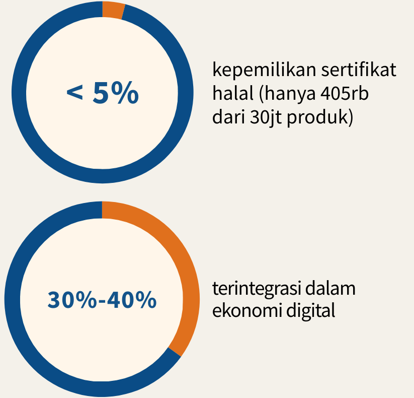
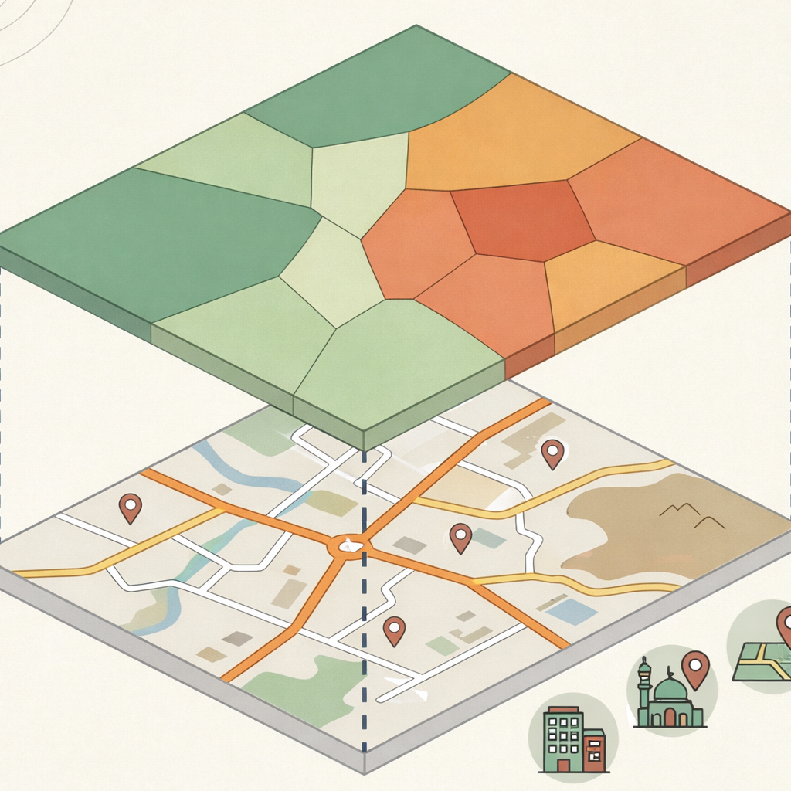
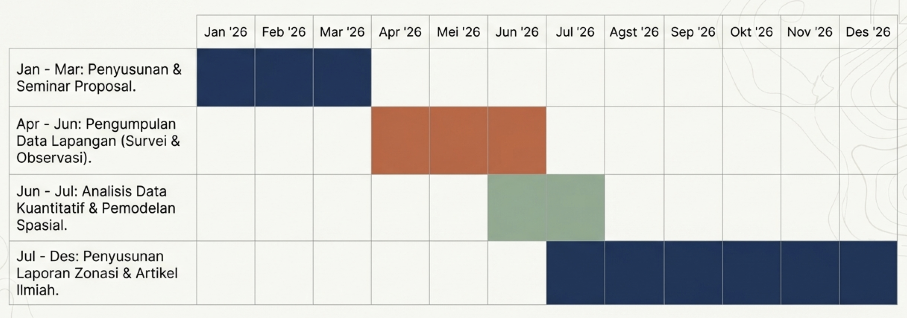

::: {.title-slide}

<h1>Zonasi Intervensi Kebijakan UMKM Kota Mataram</h1>

Pemetaan Geospasial untuk Akselerasi Digitalisasi dan Sertifikasi Halal

Proposal Penelitian Terapan (DUDI) - UIN Mataram  
2026

:::

# Tim Riset

<h3>Indira Puteri Kinasih</h3>

Principal Investigator

Spatial Modelling & Methodological Design

indiraputeri@uinmataram.ac.id  
<a href="https://orcid.org/0009-0009-6959-6723" target="_blank">
0009-0009-6959-6723
</a>

<h3>Any Tsalasatul Fitriyah</h3>

Co-Investigator

Senior data analyst

any.tsalasatul@uinmataram.ac.id  
<a href="https://orcid.org/0000-0001-7417-7739" target="_blank">
0000-0001-7417-7739
</a>

<h3>Nurul Susianti</h3>

Junior data analyst

Data collection & instruments

nurulsusianti@uinmataram.ac.id  
<a href="https://orcid.org/0009-0006-4279-9860" target="_blank">
0009-0006-4279-9860
</a>

<h3>Ulfatun Hasanah</h3>

Junior policy analyst

Economy policy, Islamic economy

ulfatunhasanah@uinmataram.ac.id  
<a href="https://orchid.org/0000-0001-6719-3415" target="_blank">
0000-0001-6719-3415
</a>

# *Mengapa UMKM?*
## Tulang punggung ekonomi yang membutuhkan intervensi cerdas

\> 99%

Proporsi UMKM dari total unit usaha nasional

::: columns

:::column
::: callout-note
### SDGs
berperan langsung pada pengentasan kemiskinan, \
pertumbuhan ekonomi, dan inovasi industri
:::
:::

:::column
::: callout-note
### Asta cita
menjadi fokus pembangunan nasional untuk kemandirian\
ekonomi dan pemerataan
:::
:::

:::

::: callout-note
### Integrasi DUDI
mitra strategis DUDI dalam rantai\
pasok yang berkelanjutan
:::

# Paradoks UMKM di Indonesia:{background-image="figs/geopoly_bg.png" background-opacity="0.15"}  
## Kuantitas Masif, Kesiapan Rendah

::: columns
::: column

\> 30jt\

unit UMKM terdaftar secara nasional (KADIN, 2024)\

Ketimpangan akses dan literasi menyebabkan kontribusi nilai tambah nasional
belum optimal

:::

::: column
  
 
:::
:::

# Potensi & *Blind spot*

# *Mengapa Pemetaan Spasial?*

::: columns
:::column
::: callout-important
### Pendekatan klasik (*blind policy*)
- kebijakan seragam
- mengabaikan ketimpangan infrastruktur antar wilayah
- seringkali tidak tepat sasaran
:::
:::

::: column
::: callout-note
### Intervensi geospasial (*precision policy*)
- kebijakan berbasis wilayah
- mengidentifikasi klaster kebutuhan secara spesifik
- distribusi anggaran dan pendampingan lebih efisien
:::
:::
:::

# *Research Questions*

1. Bagaimana tingkat Digital Readiness UMKM?
2. Bagaimana pola spasialnya?
3. Apakah terdapat klaster digital gap?
4. Bagaimana model intervensi berbasis zonasi?

# Tujuan Strategis Penelitian

# Fondasi Teoretis & Konseptual

::: columns
::: column="33%"
::: callout-note
## Literasi & Kesiapan Digital
- berbasis *technology acceptance model*(TAM) &\
indikator OECD
- mengukur kemudahan adopsi dan integrasi\
operasional
:::
:::

::: column="33%"
::: callout-note
## Regulasi Sertifikasi Halal
- merujuk pada UU no. 33 tahun 2014 ttg jaminan produk halal;
- fokus pada kepatuhan proses dan perluasan akses pasar
:::
:::

::: column="33%"
::: callout-note
## Model Regresi Spasial
- menggunakan pendekatan Bayesian Conditionally Autoregressive (CAR);
- mengatasi bias asumsi independensi pada UMKM yang berdekatan/bertetangga (*neighbourhood*)
:::
:::

:::

# Data dan Sampel

# Instrumen Pengukuran: *Digital Readiness Index*

::: columns
::: column
::: callout-tip
## 4 Dimensi Utama
- Infrastruktur Digital
- Literasi Digital
- Adopsi *platform*
- Manajemen & Keamanan
:::
:::

::: column
::: callout-important
## Formulasi

Agregasi skor tiap dimensi menjadi skor \text{DRI} tunggal per lokasi

$$
\text{Dim}_i = 
\frac{\sum_{m=1}^{M} b_{mi}}{S_{\max}} \times 100
$$

$$
\text{DRI}_j = 
\frac{1}{N} \sum_{i=1}^{N} \text{Dim}_i
$$
:::
:::

:::

# Konstruksi Variabel

::: columns
::: column

:::

::: column
::: callout
## Variabel respon
Skor agregat Digital Readiness Index (DRI) pada level desa/kelurahan
:::

::: callout
## Kovariat
- Kepadatan penduduk
- Akses internet
- akses wisata
- status kepemilikan sertifikasi halal
:::
:::

:::

# Model Statistik: *Conditionally Autoregressive* (CAR)

::: callout-note
Model CAR digunakan untuk mengakomodasi **ketergantungan spasial antar desa/kelurahan**,  
di mana tingkat kesiapan digital UMKM pada suatu wilayah dapat dipengaruhi oleh kondisi wilayah di sekitarnya.

$$
DRI_j=\beta_0 + \sum_{k=1}^p\beta_kX_{kj}+\varepsilon_j+u_j
$$

**Notasi model**

::: {.columns}

::: {.column width="50%"}

- $DRI_j$ : *Digital Readiness Index* pada kecamatan \(j\)  
- $X_{kj}$ : kovariat ke-\(k\)

:::

::: {.column width="50%"}

- $\beta_k$ : koefisien regresi  
- $\varepsilon_j$ : error acak  
- $u_j$ : efek spasial (CAR)

:::

:::

:::

> Model CAR memungkinkan analisis kesiapan digital UMKM dengan mempertimbangkan ketergantungan spasial antar desa/kelurahan.

# Luaran Penelitian

::: {.columns}

::: {.column width="50%"}

::: {.callout-note}
### Peta Interaktif UMKM
Visualisasi spasial berbasis web yang menampilkan distribusi, karakteristik, dan tingkat kesiapan digital UMKM di Kota Mataram.
:::

::: {.callout-note}
### Indeks DRI per Kecamatan
Indeks komposit yang mengukur tingkat kesiapan digital UMKM pada setiap kecamatan untuk mendukung pemetaan prioritas kebijakan.
:::

:::

::: {.column width="50%"}

::: {.callout-note}
### Model Spasial CAR
Model statistik spasial untuk mengidentifikasi pola ketergantungan wilayah dan faktor yang memengaruhi kesiapan digital UMKM.
:::

::: {.callout-note}
### Policy Brief untuk Pemkot
Dokumen rekomendasi kebijakan berbasis data bagi pemerintah daerah dalam pengembangan UMKM dan transformasi digital.
:::

::: {.callout-note}
### Artikel Ilmiah
Publikasi hasil penelitian pada jurnal ilmiah sebagai kontribusi akademik dalam bidang ekonomi regional dan analisis spasial.
:::

:::

:::

# Timeline

# Dampak yang Diharapkan

::: {.columns}

::: {.column width="33%"}

::: {.callout-note}
### Kebijakan Berbasis Bukti
Hasil penelitian menyediakan dasar empiris bagi pemerintah daerah dalam merumuskan kebijakan pengembangan UMKM yang berbasis data.
:::

:::

::: {.column width="33%"}

::: {.callout-note}
### Intervensi Tepat Sasaran
Pemetaan kesiapan digital memungkinkan identifikasi wilayah prioritas sehingga program digitalisasi UMKM dapat dilakukan secara lebih efektif.
:::

:::

::: {.column width="33%"}

::: {.callout-note}
### Replikasi Model
Kerangka indeks dan model spasial yang dikembangkan dapat diadaptasi untuk analisis kesiapan digital UMKM di wilayah lain.
:::

:::

:::

# Terima Kasih